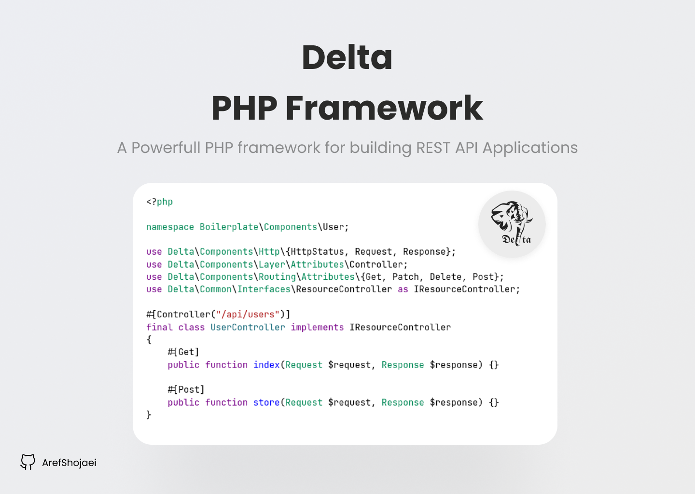
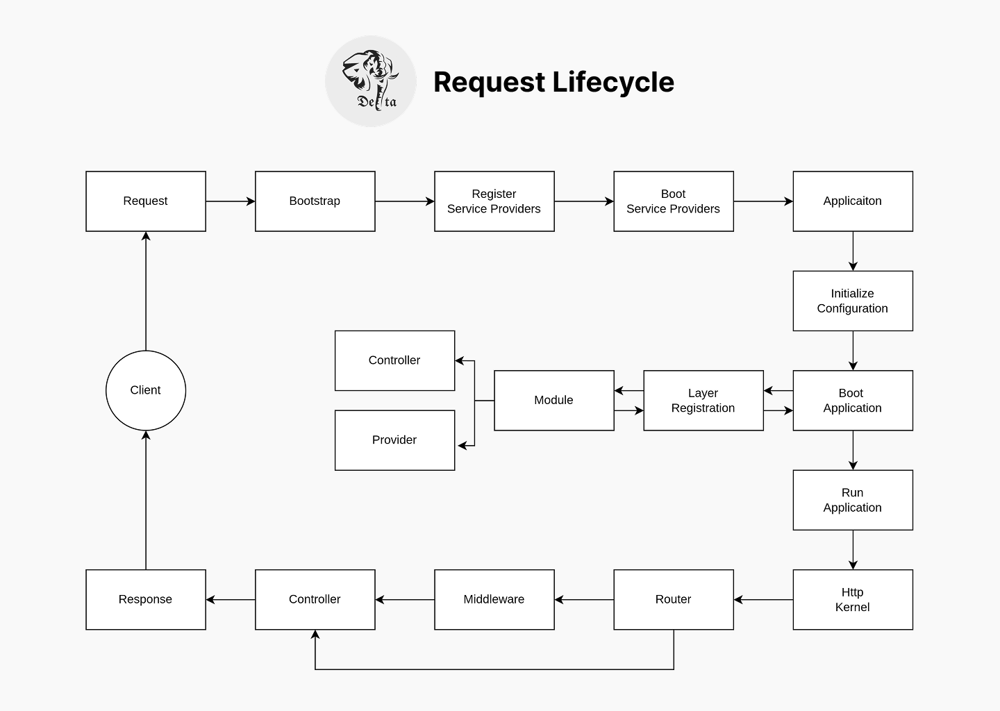

<p align="center">
  <a href="https://github.com/ArefShojaei/Delta" target="blank"></a>
</p>

  <p align="center">A <a href="https://php.net" target="_blank">PHP</a> framework for building efficient and scalable server-side applications.</p>



## Request Lifecycle


## Installation

> Using Composer
```bash
composer require arefshojaei/delta
```

> Or Using Git
```bash
git clone https://github.com/ArefShojaei/Delta.git
```